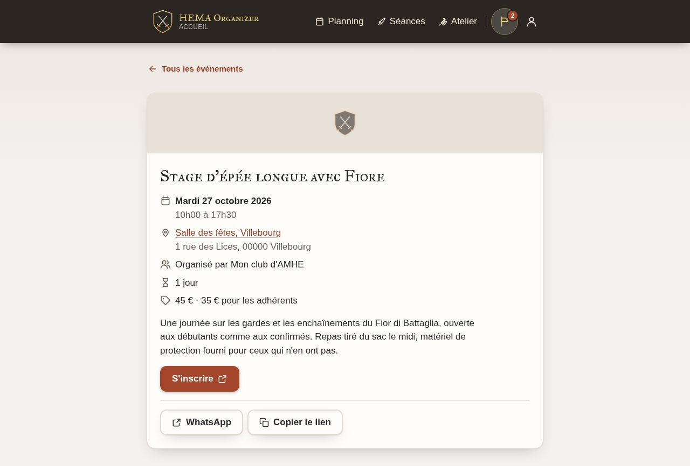
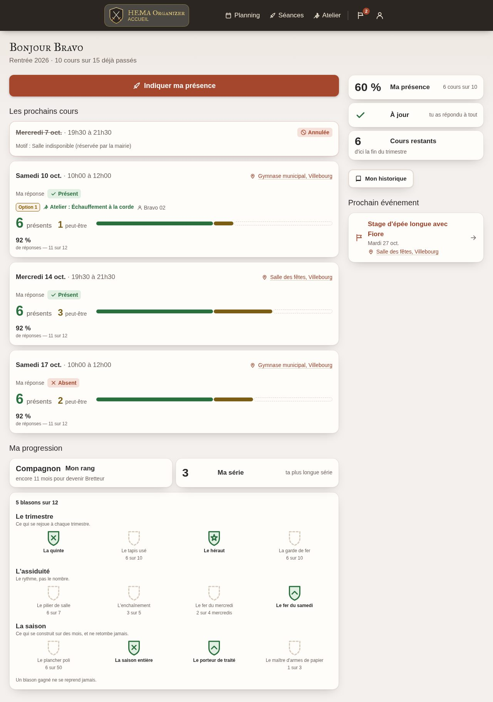
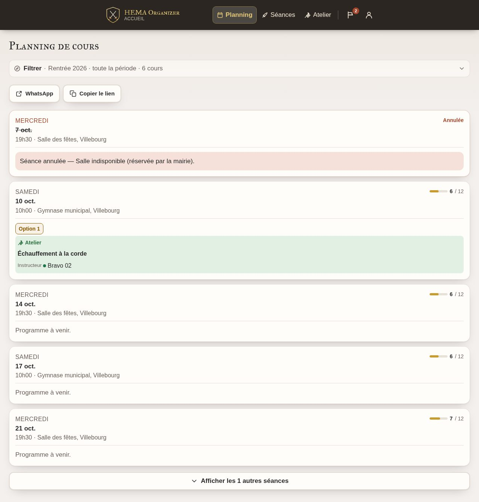
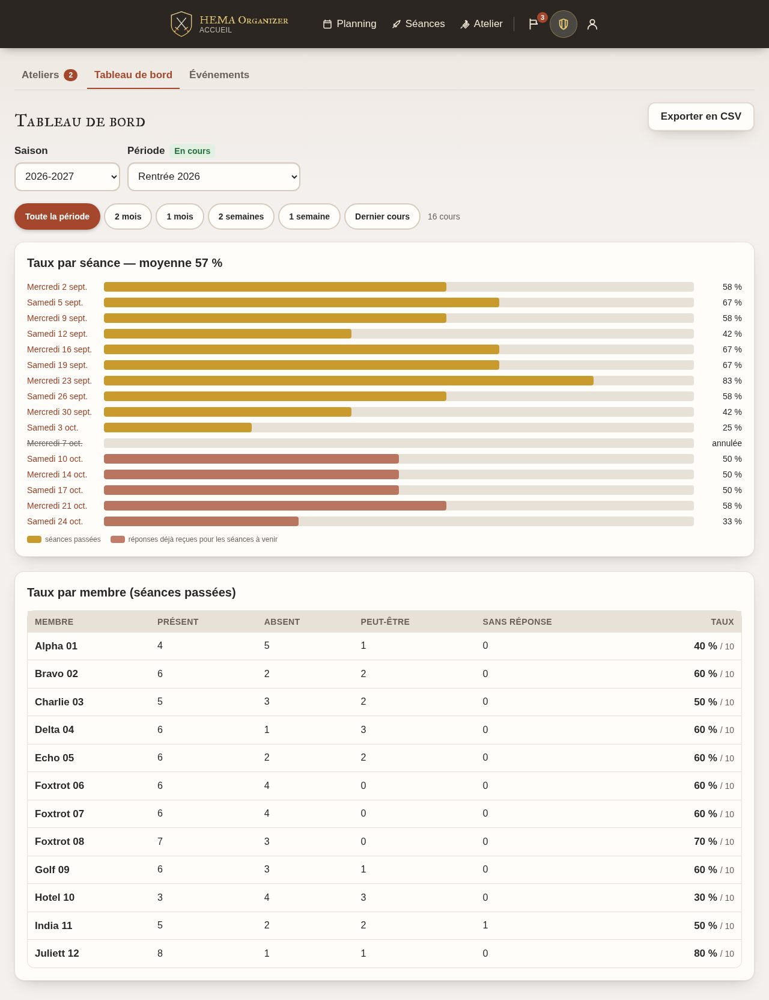
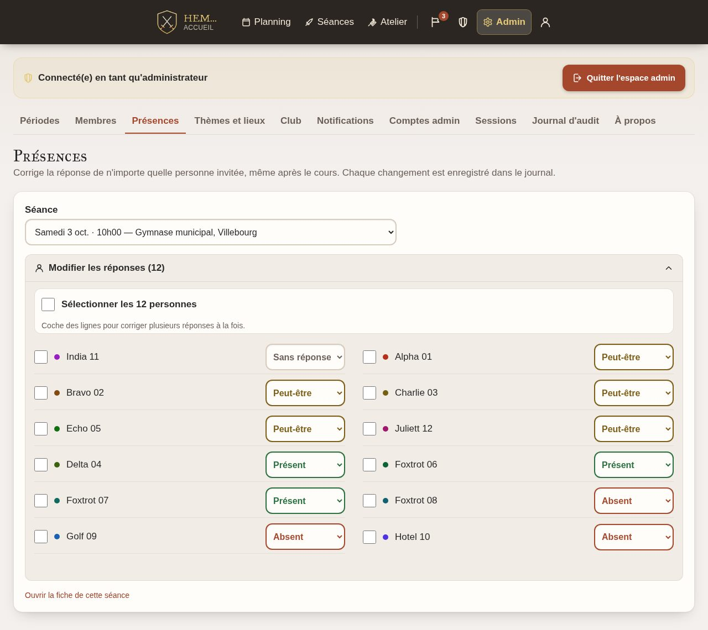
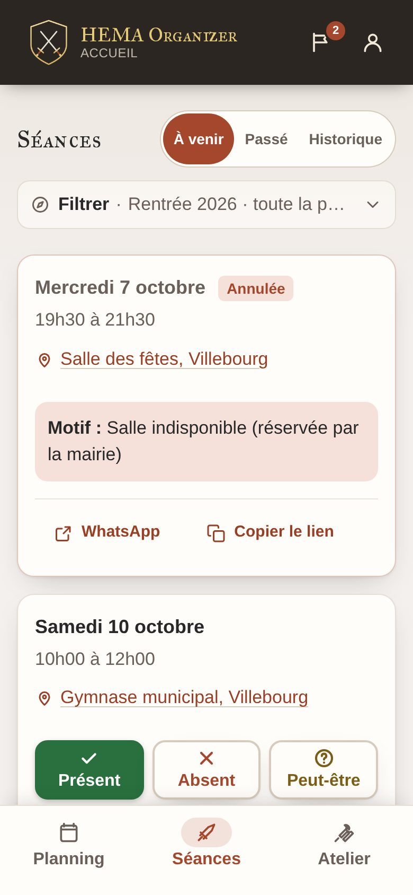
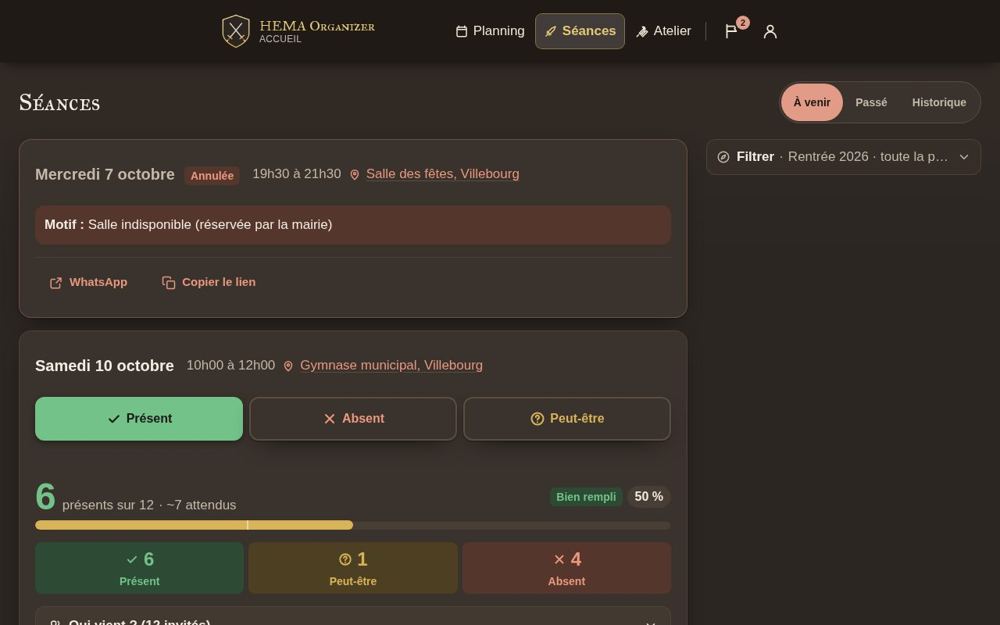
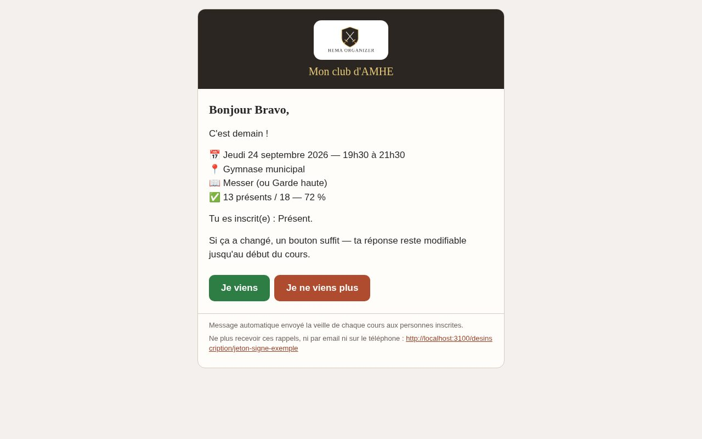

# HEMA Organizer

Un club d'AMHE, c'est deux ou trois séances par semaine, une salle à remplir, des instructeurs qui
préparent leur cours, des stages à annoncer et un trimestre à tenir. **HEMA Organizer rassemble tout
ça dans une application web que le club héberge lui-même.**

Chacun ouvre l'appli et dit s'il vient au prochain cours : ✅ présent, ❌ absent, 🤔 peut-être. Les
instructeurs voient tout de suite le remplissage de chaque séance, montent le programme — un premier
cours à la longue épée, un second au messer, un atelier proposé par un membre — et décident des
propositions. Le bureau tient le trimestre, les comptes et les accès. La veille du cours, le
récapitulatif part tout seul : email, salon Discord ou Telegram, notification sur le téléphone.

Et parce qu'un club ne vit pas que de ses séances, les **stages, tournois et démonstrations** ont leur
place : une annonce avec son affiche, ses dates, son lieu, ses tarifs et son lien d'inscription, que
le club publie quand il veut et qui s'affiche aussi sur son site.

Rien à créer pour entrer : chacun reçoit **son lien personnel** par email et il le connecte
directement. Un mot de passe et une double authentification sont là pour qui les veut, obligatoires
pour le bureau seulement. L'interface est en français, sobre, et faite pour qu'on réponde depuis le
quai du tram en deux gestes — c'est aussi ce qu'on attend d'un outil qu'on utilise cinquante fois par
trimestre.

Le nom du club, son sigle, ses logos, ses couleurs, ses salles, ses jours de cours et ses douze thèmes
graphiques sont des **réglages** : une autre association installe la même image et la met à ses
couleurs sans toucher au code.

<sub>Next.js 15 · TypeScript · SQLite (Prisma) · Tailwind · une seule image Docker · AGPL-3.0</sub>

### Ce que ça fait

| Pour un membre | Pour un instructeur | Pour le bureau |
|---|---|---|
| Répondre aux prochains cours, voir son historique et son taux de présence | Le planning du trimestre, **partie par partie** : qui mène, qui assiste, le thème, le niveau | Les trimestres, les séances engendrées en récurrence, l'annuaire et les liens d'accès |
| Proposer un atelier et suivre la réponse | Valider, refuser ou **programmer** un atelier dans une séance | Corriger les réponses d'un cours, **par lots**, même après coup |
| Lire les annonces de stages et de tournois, et s'inscrire par le lien de l'organisateur | **Annoncer un événement** : affiche, dates, lieu, tarifs, lien d'inscription — en brouillon puis publié | Ce que le club envoie et publie : email, Discord, Telegram, téléphone, site web |
| Installer l'application sur son téléphone et recevoir les rappels | Annuler un cours : l'annonce part aussitôt, avec le motif | Double authentification **obligatoire**, sessions révocables, journal d'audit |
| Un lien personnel, ou un mot de passe et une double authentification s'il le souhaite | Le tableau de bord : taux par séance, par membre, export CSV | La part d'effectif sous laquelle un cours est « en danger », et l'alerte qui va avec |

### Les stages, tournois et démonstrations

Une annonce se crée en brouillon, se relit, puis se publie — et c'est **la publication** qui déclenche
l'annonce, une seule fois : email aux membres des trimestres en cours, message sur le salon, et
notification sur le téléphone de qui l'a activée. Une correction après coup **met à jour** le message
déjà posté au lieu d'en poster un second ; dépublier le barre.

<p align="center"><br>
<i>Une annonce telle qu'un membre la lit, avec son bouton d'inscription et son lien à partager.</i></p>

Elle porte ce dont un club a besoin pour décider s'il y va : les dates (avec l'heure, et la durée si
l'événement tient sur plusieurs jours), le lieu et son adresse, l'organisateur, le tarif en texte
libre — « 25 € », « 15 € / 10 € adhérents », « prix libre » —, le lien d'inscription, la publication
d'origine et une affiche. Chaque annonce a sa **page de partage**, lisible sans compte, à coller dans
un groupe de messagerie ; et le club peut la republier sur son propre site, par l'API et le plugin
WordPress livrés ici.

## Aperçu

Captures de la démonstration livrée (`npm run db:seed:demo`) — un club fictif, des données
fabriquées.

<table>
  <tr>
    <td width="50%"></td>
    <td width="50%"></td>
  </tr>
  <tr>
    <td><b>L'accueil</b> — les prochains cours, le plus proche en haut, et la réponse en un tap.</td>
    <td><b>Le planning</b> — en lecture seule par défaut ; « Modifier le planning » ouvre la saisie.</td>
  </tr>
  <tr>
    <td></td>
    <td></td>
  </tr>
  <tr>
    <td><b>Le tableau de bord</b> — taux par séance, par membre, export CSV.</td>
    <td><b>Les présences</b> — corriger le registre d'un cours, une ligne ou tout un lot.</td>
  </tr>
  <tr>
    <td></td>
    <td></td>
  </tr>
  <tr>
    <td><b>Sur un téléphone</b> — installable depuis le navigateur, notifications comprises.</td>
    <td><b>Mode sombre</b> — suit le réglage du système, et douze thèmes au choix du club.</td>
  </tr>
</table>

<p align="center"><br>
<i>Le rappel de la veille, envoyé à ceux qui ont répondu « présent » ou « peut-être ».</i></p>

## Essayer en deux minutes

```bash
cp .env.example .env     # renseigner SESSION_SECRET, ADMIN_EMAIL, ADMIN_PASSWORD
docker compose up --build
```

L'application répond sur <http://organizer.localhost:3000>. Les emails ne partent pas sans `SMTP_HOST` :
ils s'écrivent en HTML dans `previews/emails/`.

## Installer l'application — guide pas à pas

**Comptez une demi-heure.** Ce guide est écrit pour quelqu'un qui n'a jamais déployé : chaque étape
dit où cliquer et **exactement quoi remplacer**. Partout où vous lisez `organizer.mon-club.fr` ou
`contact@mon-club.fr`, mettez vos valeurs à vous.

**Il n'y a rien à compiler et rien à copier** : l'image Docker est publiée, prête à l'emploi, et
Portainer la télécharge tout seul. Le guide complet — variables une à une, mises à jour,
sauvegardes, retour en arrière, dépannage — est dans **[docs/DEPLOIEMENT.md](docs/DEPLOIEMENT.md)**.
Celui-ci est le chemin court.

### Avant de commencer : les quatre prérequis

| Ce qu'il faut | Pourquoi | Si vous ne l'avez pas |
|---|---|---|
| **Un serveur Linux avec Docker** — un petit VPS ou un NAS suffisent (1 processeur, 1 Go de mémoire, 10 Go de disque) | C'est lui qui fait tourner l'application, jour et nuit | Un VPS à quelques euros par mois chez n'importe quel hébergeur fait l'affaire |
| **Portainer** sur ce serveur | L'interface web qui gère Docker à votre place : vous ne taperez que trois commandes dans tout ce guide | [Installation de Portainer](https://docs.portainer.io/start/install-ce/server/docker/linux) (une commande, une fois) |
| **Nginx Proxy Manager** (NPM) sur le même serveur | C'est lui qui donne l'adresse `https://` et le cadenas du navigateur | [Installation de NPM](https://nginxproxymanager.com/guide/#quick-setup) (un `docker-compose`, une fois) |
| **Un nom de domaine**, par exemple `organizer.mon-club.fr`, **déjà pointé sur l'adresse IP du serveur** | Sans lui, pas de `https://`, et les liens envoyés par email ne mènent nulle part | Chez votre registrar : un enregistrement `A` qui pointe vers l'IP du serveur. Comptez jusqu'à une heure de propagation |

Il faut aussi **une boîte email d'envoi** (SMTP) : adresse, serveur, identifiant, mot de passe.
L'application envoie les liens de connexion et les rappels par email — **sans elle, personne ne peut
entrer**. La boîte de contact du club chez votre hébergeur convient ; avec Gmail, il faut créer un
*mot de passe d'application*.

### Préparez vos valeurs maintenant

Recopiez ce tableau dans un bloc-notes et remplissez-le **avant** de commencer : vous le recopierez
tel quel à l'étape 3, et vous n'aurez plus à chercher.

| Nom | Ce que vous mettez | Exemple |
|---|---|---|
| `DOMAIN` | votre domaine, **sans** `https://` et **sans** barre oblique à la fin | `organizer.mon-club.fr` |
| `DATA_DIR` | le dossier du serveur qui portera la base et les sauvegardes | `/srv/organizer` |
| `SESSION_SECRET` | une longue suite de caractères au hasard. Obtenez-la avec `openssl rand -base64 48` sur le serveur. **Gardez-la** : la changer déconnecte tout le monde | `kJ8…` (64 caractères) |
| `SMTP_HOST` | le serveur d'envoi de votre boîte email | `mail.mon-hebergeur.fr` |
| `SMTP_PORT` | `587` dans la très grande majorité des cas | `587` |
| `SMTP_USER` | l'identifiant de cette boîte, souvent l'adresse elle-même | `contact@mon-club.fr` |
| `SMTP_PASS` | le mot de passe de cette boîte | — |
| `SMTP_FROM` | l'expéditeur affiché. **Sans guillemets** | `Mon club <contact@mon-club.fr>` |
| `ADMIN_EMAIL` | l'adresse du premier compte d'administration. **Prenez l'adresse de contact du club, pas celle d'une personne** | `contact@mon-club.fr` |
| `ADMIN_PASSWORD` | un mot de passe **provisoire**, 10 caractères minimum. Vous le changerez à la première connexion | `installation-2026` |

### Étape 1 — Créez les deux dossiers sur le serveur

Connectez-vous au serveur en SSH et tapez ces trois lignes, en remplaçant `/srv/organizer` par votre
`DATA_DIR` si vous en avez choisi un autre :

```bash
sudo mkdir -p /srv/organizer/data /srv/organizer/backups
sudo chown -R 1000:1000 /srv/organizer
sudo chmod -R 750 /srv/organizer
```

*Ce que font ces lignes :* le premier dossier portera la base de données, le second les sauvegardes
de chaque nuit. L'application ne tourne pas en administrateur — elle a donc besoin qu'on lui donne
le droit d'écrire ici (`chown`), et le `chmod` interdit aux autres comptes du serveur de lire ces
fichiers. **Ne sautez pas la troisième ligne** : la sauvegarde de la nuit contient tout l'annuaire
du club.

### Étape 2 — Créez la stack

Une *stack*, c'est la description de ce qui doit tourner. Vous n'avez rien à écrire : le fichier est
dans le dépôt.

1. Ouvrez **[docs/portainer-stack.yml](docs/portainer-stack.yml)** et copiez **tout** son contenu.
2. Dans Portainer : **Stacks** → **Add stack**.
   - *Name* : `hema-organizer`
   - *Build method* : **Web editor**
   - collez le fichier dans la grande zone de texte, **sans rien y modifier**

Tout ce qui change d'un club à l'autre passe par les variables de l'étape suivante : il n'y a jamais
de raison de retoucher ce fichier.

### Étape 3 — Saisissez vos valeurs

Toujours sur le même écran, plus bas : section **Environment variables**, bouton **Advanced mode**.
Collez vos valeurs du tableau préparé plus haut, une par ligne, sous la forme `NOM=valeur` :

```
DOMAIN=organizer.mon-club.fr
DATA_DIR=/srv/organizer
SESSION_SECRET=<collez ici la sortie de openssl rand -base64 48>
SMTP_HOST=mail.mon-hebergeur.fr
SMTP_PORT=587
SMTP_USER=contact@mon-club.fr
SMTP_PASS=le-mot-de-passe-de-la-boîte
SMTP_FROM=Mon club <contact@mon-club.fr>
ADMIN_EMAIL=contact@mon-club.fr
ADMIN_PASSWORD=installation-2026
```

Trois pièges, et ce sont les trois seuls :

- **pas de guillemets** autour des valeurs — Portainer les garderait comme faisant partie du texte, et
  le serveur d'emails rejetterait l'expéditeur ;
- **`DOMAIN` sans `https://`** ;
- **`DATA_DIR` doit être le dossier que vous venez de créer**, et jamais celui d'une autre
  installation : deux applications sur la même base, c'est une base perdue.

Il reste une valeur à vérifier : `NPM_NETWORK`, le nom du réseau que Docker a donné à Nginx Proxy
Manager. Regardez dans Portainer → **Networks** : s'il s'appelle `npm_default`, vous n'avez rien à
faire ; sinon, ajoutez une ligne `NPM_NETWORK=le-nom-que-vous-voyez`.

### Étape 4 — Démarrez, et lisez les journaux

Bouton **Deploy the stack**, en bas. Portainer télécharge l'image publiée et démarre le conteneur.
Puis **Containers** : `hema-organizer` doit passer *running*, puis *healthy* en moins d'une minute.

> **Si le téléchargement est refusé avec `toomanyrequests`**, ce n'est pas votre installation : Docker
> Hub limite le nombre de téléchargements anonymes par adresse IP et par heure. Deux remèdes :
> attendre une heure, ou créer un compte Docker Hub gratuit et le déclarer une fois dans Portainer
> (**Registries** → **Add registry** → **DockerHub**), ce qui multiplie la limite par dix.

Cliquez sur son nom, puis sur **Logs**. Vous devez y lire, dans cet ordre :

```
[hema] Organizer — démarrage (fuseau Europe/Paris).
[hema] Application des migrations de la base…
[hema] Base à jour.
[hema] Vérification du compte d'administration…
[seed] compte d'administration contact@… créé (mot de passe provisoire : à changer à la première connexion).
[hema] Lancement du serveur sur 0.0.0.0:3000.
✓ Ready in …
```

Si le conteneur s'arrête tout de suite, le journal dit pourquoi en français, et c'est presque
toujours `SESSION_SECRET` (absente ou plus courte que 32 caractères) ou `DOMAIN` (laissé sur une
adresse locale).

### Étape 5 — Donnez-lui son adresse https

Dans Nginx Proxy Manager : **Hosts** → **Proxy Hosts** → **Add Proxy Host**.

Onglet **Details** :

| Champ | Valeur |
|---|---|
| *Domain Names* | `organizer.mon-club.fr` |
| *Scheme* | `http` |
| *Forward Hostname / IP* | `hema-organizer` — le **nom du conteneur**, pas une adresse IP |
| *Forward Port* | `3000` |
| *Block Common Exploits* | activé |
| *Websockets Support* | activé |

Onglet **SSL** : *SSL Certificate* → **Request a new SSL Certificate**, puis activez *Force SSL*,
*HTTP/2 Support* et *HSTS Enabled*, acceptez les conditions et donnez une adresse email. Le domaine
doit déjà pointer sur le serveur, sinon la demande de certificat échoue.

**Une dernière chose, et elle n'est pas facultative.** Les liens de connexion envoyés par email
portent un jeton dans leur adresse : ce jeton **vaut un mot de passe**, et le journal d'accès du
proxy l'écrirait en clair à chaque ouverture. Onglet **Advanced**, collez ce bloc :

```nginx
location ~ ^/(invitation|reinitialiser|annuler|desinscription)/ {
  access_log off;
  resolver 127.0.0.11 valid=10s;
  set $app hema-organizer;
  proxy_http_version 1.1;
  proxy_set_header Host $host;
  proxy_set_header X-Real-IP $remote_addr;
  proxy_set_header X-Forwarded-For $remote_addr;
  proxy_set_header X-Forwarded-Proto $scheme;
  proxy_pass http://$app:3000$request_uri;
}
```

Remplacez `hema-organizer` par le nom que vous avez mis dans *Forward Hostname*, puis **Save**.

> **Avant de refermer la fenêtre, vérifiez.** Nginx Proxy Manager recharge la configuration de
> **tous** ses sites d'un coup : une faute de frappe ici les fait tomber ensemble, sa propre
> interface comprise. Depuis le serveur :
>
> ```bash
> docker exec <nom-du-conteneur-npm> nginx -t
> ```
>
> Si le test échoue : videz le champ *Advanced*, enregistrez, recommencez. Si l'interface de NPM ne
> répond plus, `docker restart <nom-du-conteneur-npm>` la ramène.

Le détail de ce bloc — et la version avec limitation de débit — est au § 5 de
[docs/DEPLOIEMENT.md](docs/DEPLOIEMENT.md).

### Étape 6 — Première connexion

Ouvrez `https://organizer.mon-club.fr/connexion` et entrez votre `ADMIN_EMAIL` et le mot de passe
**provisoire** `ADMIN_PASSWORD`.

L'application vous impose aussitôt, dans cet ordre : un vrai mot de passe, une double
authentification (un QR code à scanner avec une application d'authentification sur votre téléphone),
puis **huit codes de secours**. Ces codes ne sont montrés qu'une fois — écrivez-les et rangez-les
ailleurs que sur le téléphone.

Une fois ce parcours terminé, `ADMIN_PASSWORD` ne sert plus à rien.

### Étape 7 — Mettez le club à ses couleurs, et ouvrez-lui la porte

Dans **Espace admin** :

1. **Club** — le nom, le sigle, les logos, la couleur et le thème. C'est ce qui s'affiche partout et
   dans les emails.
2. **Notifications → Email** — bouton **« M'envoyer un email de test »**. **Ne sautez pas cette
   étape** : une configuration SMTP fausse ne se voit nulle part ailleurs, et c'est elle qui enverra
   les liens de connexion. Le verdict exact du serveur s'affiche juste en dessous.
3. **Thèmes et lieux** — vos salles avec leur adresse, et les thèmes que les instructeurs
   choisiront dans le planning.
4. **Périodes** — créez le premier trimestre, ses jours et ses horaires : les séances sont engendrées
   d'un coup.
5. **Membres** — importez l'annuaire (CSV) ou saisissez-le. **Vous n'avez rien à envoyer** : chaque
   membre reçoit son lien personnel tout seul, trois jours avant le premier cours.

### Vérifiez que tout est en place

- [ ] `https://organizer.mon-club.fr` s'ouvre, avec le cadenas
- [ ] le conteneur est *healthy* dans Portainer
- [ ] l'email de test est arrivé
- [ ] **Espace admin → À propos** affiche le dossier des sauvegardes et la version qui tourne
- [ ] un lien personnel s'ouvre bien : depuis **Membres**, renvoyez-vous le vôtre et cliquez dessus

### Et ensuite

| | |
|---|---|
| **Mettre à jour** | **Update the stack**, et c'est tout : l'image est suivie en `latest` et retéléchargée à chaque déploiement. La base n'est pas touchée, les migrations s'appliquent au démarrage. [§ 7 et § 8 du guide](docs/DEPLOIEMENT.md) |
| **Revenir en arrière** | Ajoutez la variable `APP_TAG` avec la version visée (`0.61.2`), redéployez. C'est son seul usage. Attention : une migration déjà appliquée ne s'annule pas — [§ 9](docs/DEPLOIEMENT.md) |
| **Sauvegardes** | Une copie de la base part chaque nuit à 03:30 dans `backups/`, gardée 30 jours. Recopiez-la **hors du serveur** : [§ 10](docs/DEPLOIEMENT.md) |
| **En cas de problème** | Le tableau de dépannage, symptôme par symptôme : [§ 13](docs/DEPLOIEMENT.md) |
| **Sécurité** | Ce qui protège le club, et ce qui reste à faire sur votre serveur : [docs/SECURITE.md](docs/SECURITE.md) |
| **Donner les guides au club** | Trois PDF prêts à envoyer : [docs/guides/](docs/guides/) |

### Fabriquer votre propre image

Rien n'y oblige : la stack livrée pointe sur l'image publique `hematools/hema-organizer`, suivie en
`latest`. Cette section est pour qui **modifie le code** ou veut ranger l'image dans son
propre registre.

1. Faites un *fork* du dépôt, puis poussez un tag : GitHub Actions
   (`.github/workflows/release.yml`) construit l'image et la publie.

   ```bash
   git tag v1.0.0 && git push origin v1.0.0
   ```

   **Où elle part dépend de vous.** Si votre dépôt porte les secrets `DOCKERHUB_USERNAME` et
   `DOCKERHUB_TOKEN`, l'image va sur Docker Hub, dans l'espace de ce compte. Sinon elle va sur
   `ghcr.io`, dans l'espace du propriétaire du dépôt, avec le jeton que GitHub fournit tout seul —
   rien à créer.

2. Ajoutez `IMAGE=…` aux variables de la stack, avec l'adresse de votre image **sans son numéro de
   version** : `docker.io/mon-compte/hema-organizer` ou `ghcr.io/mon-compte/hema-organizer`.
3. Si vous laissez votre image **privée**, déclarez le registre dans Portainer — **Registries** →
   **Add registry** → **Custom registry**, avec l'adresse du registre et vos identifiants. Sur
   `ghcr.io`, le mot de passe est un [jeton d'accès personnel](https://github.com/settings/tokens)
   avec la seule portée `read:packages`. Une image publique ne demande rien.

## Les trois guides d'utilisation

Livrés avec l'application, **prêts à imprimer ou à envoyer au club** — un guide par rôle, en PDF et
en HTML. Ce sont des marches à suivre : titres qui commencent par un verbe, étapes numérotées,
captures d'écran, aucun jargon. Ils se lisent **en cascade** : le guide du membre dit ce que tout le
monde fait, et les deux autres ne le répètent pas.

| | Pour qui | Ce qu'il couvre | |
|---|---|---|---|
| 📘 **Guide du membre**<br>12 pages | les adhérents | Entrer dans l'application, dire si on vient, lire le planning, proposer un atelier, les événements, son profil et ses messages | **[PDF](docs/guides/HEMA-Organizer-guide-membre.pdf)** · [HTML](docs/guides/guide-membre.html) |
| 📗 **Guide de l'instructeur**<br>11 pages | l'encadrement | Remplir le planning partie par partie, tenir les séances, décider des ateliers, publier les annonces, le tableau de bord | **[PDF](docs/guides/HEMA-Organizer-guide-instructeur.pdf)** · [HTML](docs/guides/guide-instructeur.html) |
| 📕 **Guide de l'administrateur**<br>20 pages | le bureau | Ouvrir l'espace admin, la saison, corriger les présences, l'annuaire et les rôles, les liens et les comptes, Discord et Telegram, l'API publique, les thèmes et les lieux | **[PDF](docs/guides/HEMA-Organizer-guide-administrateur.pdf)** · [HTML](docs/guides/guide-admin.html) |

Ils se refont d'une commande après une modification de l'interface (`npm run guides:pdf`), captures
comprises : [docs/guides/](docs/guides/).

Et pour aller plus loin : **[modèle d'accès et défenses](docs/SECURITE.md)** ·
**[fonctionnalités en détail](docs/FONCTIONNALITES.md)** ·
**[guide de déploiement complet](docs/DEPLOIEMENT.md)**

## Développement local

> `CLAUDE.md` porte les règles de conception que le code applique, et
> `docs/FONCTIONNALITES.md` la liste de ce que l'application fait, écran par écran.


```bash
cp .env.example .env            # puis renseigner SESSION_SECRET (openssl rand -base64 48), ADMIN_EMAIL, ADMIN_PASSWORD
npm install
npx prisma migrate deploy       # crée data/organizer.db
npm run db:seed                 # compte admin (ADMIN_EMAIL / ADMIN_PASSWORD)
npm run db:seed:demo            # démo : le compte du bureau (mot de passe + code TOTP) ; tous les autres entrent par lien personnel
npm run db:seed:demo:grand      # la même démo à l'échelle d'un club de quatre-vingts (listes longues, pagination, seuils)
npm run dev                     # http://localhost:3000
```

Sans `SMTP_HOST`, les emails sont écrits dans `previews/emails/` au lieu d'être envoyés.

`npm run db:reparer` relit la base et signale les incohérences qu'elle peut contenir (réponses
sans invitation, ateliers planifiés orphelins, doublons du journal des notifications, liens
concurrents, cases de planning détachées). **Il n'écrit rien sans `--reparer`**, et prend une
sauvegarde avant d'écrire. En production, le même outil voyage dans l'image :
`docker exec <conteneur> node reparer.cjs` (voir [docs/DEPLOIEMENT.md](docs/DEPLOIEMENT.md)).

Comptes de démonstration : ils sont **tous** définis dans `prisma/comptes.ts` (adresses, mot de passe et
secret TOTP du bureau, jetons de lien fixes). Un seul compte a un mot de passe — celui du bureau ; les
autres s'ouvrent par leur lien personnel, dont l'adresse se construit avec `demoLien(email)`.

### Tests et aperçus

```bash
npm run lint && npm run typecheck && npm test   # lint, types, tests unitaires (Vitest)
npx playwright install chromium                 # une fois
npm run test:e2e                                # tests de bout en bout (reseed automatique)
npm run preview:screenshots                     # captures mobile/PC × clair/sombre dans previews/
npm run guides:pdf                              # les trois guides d'utilisation en PDF (docs/guides/)
```

## Notifications sur le téléphone

En plus des emails et du salon Discord, l'application prévient les membres **directement sur leur
appareil** (Web Push) : rappel de cours, annulation, réponse à une proposition d'atelier — même
l'application fermée. Chacun active le canal appareil par appareil depuis **Mon profil**, et choisit
message par message ce qu'il reçoit par email et ce qu'il reçoit sur son téléphone ; le bureau garde
la main sur ce que le club envoie (**Espace admin → Notifications**).

Chaque message d'information s'envoie au choix **« chacun le sien »** (un email par personne, le
mode livré) ou **« la liste »** (une seule adresse de distribution tenue par le serveur mail du
club) — de quoi rester sous le quota d'un SMTP gratuit quand le club grandit. Aucun message portant
un lien personnel ne peut emprunter la liste : il est relu au départ et refusé. Le téléphone, lui,
reste personnel dans les deux modes.

**Rien à configurer côté serveur** : les clés d'envoi (VAPID) sont engendrées au premier besoin et
rangées chiffrées en base — aucune variable à ajouter, y compris en production. Seule contrainte :
le site doit être servi en **HTTPS** (ou `localhost` en développement), sinon le navigateur refuse
l'abonnement.

> **Sur iPhone et iPad, l'application doit d'abord être ajoutée à l'écran d'accueil**
> (*Partager → « Sur l'écran d'accueil »*, iOS 16.4+) : sans cela, les notifications n'existent tout
> simplement pas pour le navigateur. L'écran « Mon profil » le détecte et explique la marche à suivre.

Les icônes de l'application installée se regénèrent depuis l'écu du logo :

```bash
npm run icons:generate       # 192, 512, maskable, badge et apple-touch-icon dans public/icons/
```

## Image Docker

Le `Dockerfile` (multi-étapes, `node:22-alpine`) produit une image autonome : sortie Next.js
`standalone`, utilisateur non-root, migrations Prisma et compte d'administration appliqués au
démarrage par `docker/entrypoint.sh`, base dans `/data`, sauvegardes quotidiennes dans `/backups`.

Vérifier l'image en local, dans les conditions de la production (`cap_drop: ALL`,
`no-new-privileges`, `/tmp` en tmpfs) :

```bash
docker compose up --build                            # http://organizer.localhost:3000
curl -s http://organizer.localhost:3000/api/health   # {"ok":true}
docker compose down -v                               # arrêt et suppression des volumes de test
```

Deux variables, et il faut les bouger **ensemble** : `HEMA_PORT` change le port publié, `HEMA_DOMAIN`
l'adresse que l'application se connaît (elle sert à composer les liens des emails et à décider si le
cookie de session est `Secure`). Un port déplacé sans son domaine donne une application qui répond
mais dont tous les liens pointent ailleurs :

```bash
HEMA_PORT=3100 HEMA_DOMAIN=http://organizer.localhost:3100 docker compose up --build
```

Le domaine par défaut n'est pas `localhost` : l'application **refuse** de démarrer en production sur
un domaine local nu, exprès (un domaine local en production est presque toujours une erreur de
déploiement). `organizer.localhost` résout vers la boucle locale et passe cette garde. Si `*.localhost`
ne résout pas chez vous, mettez l'adresse de la machine : `HEMA_DOMAIN=http://192.168.1.20:3000`.

Publication et mise en production : **[docs/DEPLOIEMENT.md](docs/DEPLOIEMENT.md)**
(tag `vX.Y.Z` → image publiée sur Docker Hub, stack Portainer — référence dans
[docs/portainer-stack.yml](docs/portainer-stack.yml) —, proxy NPM, mise à jour, rollback,
sauvegarde et restauration).

## Site WordPress — les prochains cours

L'application peut publier ses prochains cours en lecture seule, sans compte :

```bash
curl "https://organizer.mon-club.fr/api/public/prochaines-seances?limit=5"
```

Date, horaire, **lieu et son adresse postale**, thème, programme (partie par partie, avec son niveau),
état (annulé et son motif) et **taux de participation** — rien de nominatif, et pas d'effectif en clair.

**Cette porte est fermée par défaut** : sans décision explicite, la route répond `503` et rien ne
sort. On l'ouvre en cochant « API publique activée » dans **Espace admin → Notifications** — un club
qui installe l'image et n'ouvre jamais cet écran ne publie donc pas sur Internet ses horaires et
l'adresse de son gymnase. Une fois ouverte : CORS limité à `PUBLIC_API_ORIGIN`, réponse mise en
cache 5 minutes, débit limité à 60 appels par minute et par IP.

Le plugin **[wordpress-plugin/hema-prochains-cours](wordpress-plugin/hema-prochains-cours/)** affiche
ces cours sur le site du club (shortcode `[hema_prochains_cours]`, cache 15 min, styles aux couleurs
du club) : voir son [README](wordpress-plugin/hema-prochains-cours/README.md) pour l'installation.
